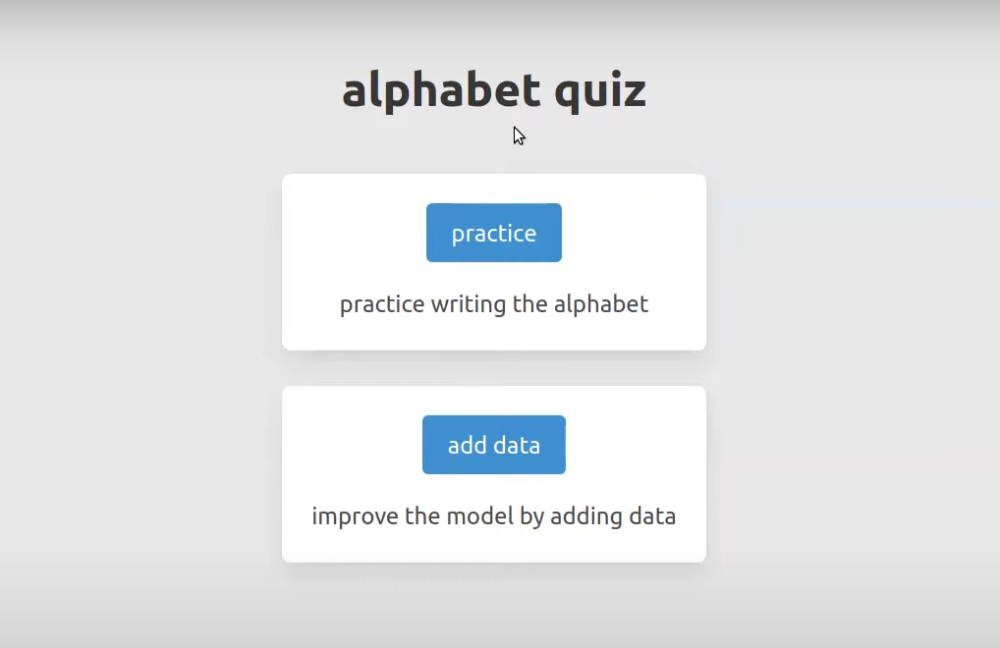
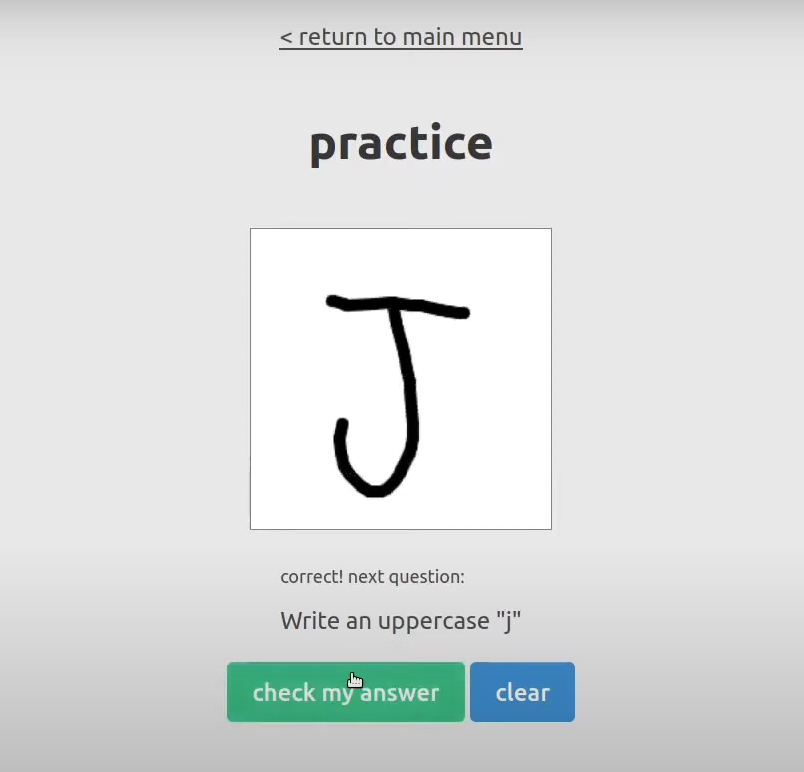
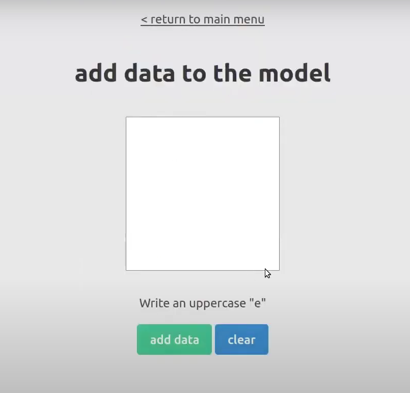

# Alphabet-Quiz
 
A machine learning web app that helps users practice writing English alphabet characters 

---

## demo

### 1) practice mode


### 2) training mode



---

## Run on your machine

### 1) environment setup
* clone the repository.
* create and start a virtual environment.
* install the following modules:
    * tensorflow
    * numpy 
    * bidict
    * flask
    * matplotlib
    * seaborn

### 2) app setup
* build the CNN model:
    ```
    run scripts/model_training.ipynb
    ```
* run the app:
    ```
    python app.py
    ```
  

### 3) useful scripts
* `scripts/model_development.ipynb`
    * python notebook for developing / tuning the model
* `scripts/data_distribution.py`
    * shows the distribution of instances within the dataset
    * ideally, this should be uniform across the 26 characters

---

## other notes


* i'm the only one who trained this model (so far), so it might be hypersensitive to my handwriting
